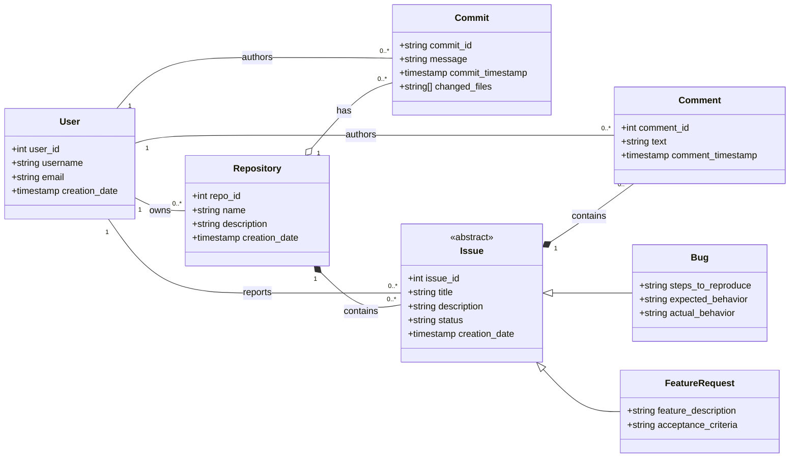

### **Rationale for Design Choices**

The UML class diagram above represents the entities for a source code repository management system. The design includes five main entities: `User`, `Repository`, `Commit`, `Issue` (as an abstract class), and `Comment`, with `Bug` and `FeatureRequest` as concrete implementations of `Issue`.

**Relationships:**

- **Association**: Standard relationships link a `User` to the `Repository` they own and the `Commits`, `Issues`, and `Comments` they author. These are simple links between independent objects.
- **Inheritance**: `Bug` and `FeatureRequest` inherit from the abstract `Issue` class, representing a clear "is-a" relationship.
- **Aggregation**: A `Repository` has a collection of `Commits`. This is a "whole-part" relationship, but the `Commits` are not destroyed if the `Repository` is deleted.
- **Composition**: A `Repository` contains `Issues`, and an `Issue` contains `Comments`. This is a strong "part-of" relationship where the parts (`Issue`, `Comment`) are destroyed if their parent is deleted.

**Complex Relationships Rationale:**

The design incorporates several complex relationships to accurately model the domain and meet the assignment requirements:

- **Inheritance**: The use of an abstract `Issue` class with `Bug` and `FeatureRequest` subclasses provides a structured and extensible system. It allows for common issue properties to be defined in one place while enabling specialized attributes for different issue types. This is a classic "is-a" relationship.

- **Association**: The links between `User` and other entities like `Commit` and `Issue` are modeled as standard associations. This is appropriate because these entities have independent lifecycles; for example, deleting a `Commit` does not delete the `User` who authored it.

- **Aggregation**: The relationship between a `Repository` and its `Commits` is modeled as aggregation. A repository is a collection of commits, representing a "has-a" relationship. However, commits can be viewed as independent entities that could, in theory, be moved between repositories or exist conceptually on their own. This weaker lifecycle dependency makes aggregation more suitable than composition.

- **Composition**: The relationships between `Repository` and `Issue`, and `Issue` and `Comment`, are modeled as composition. This represents a strong ownership where the "part" cannot exist without the "whole." An issue is intrinsically tied to a single repository and is meaningless without it. Likewise, a comment only exists within the context of a specific issue. Deleting a repository will cascade and delete its issues, and deleting an issue will delete its comments.

