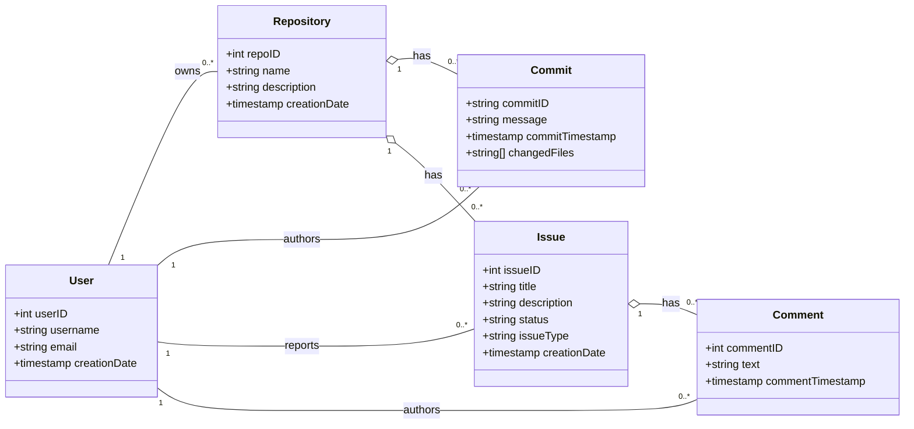

```mermaid
classDiagram
    direction LR

    class User {
        +int userID
        +string username
        +string email
        +timestamp creationDate
    }

    class Repository {
        +int repoID
        +string name
        +string description
        +timestamp creationDate
    }

    class Commit {
        +string commitID
        +string message
        +timestamp commitTimestamp
        +string[] changedFiles
    }

    class Issue {
        +int issueID
        +string title
        +string description
        +string status
        +string issueType
        +timestamp creationDate
    }

    class Comment {
        +int commentID
        +string text
        +timestamp commentTimestamp
    }

    User "1" -- "0..*" Repository : owns
    User "1" -- "0..*" Commit : authors
    User "1" -- "0..*" Issue : reports
    User "1" -- "0..*" Comment : authors

    Repository "1" o-- "0..*" Commit : has
    Repository "1" o-- "0..*" Issue : has

    Issue "1" o-- "0..*" Comment : has
```
