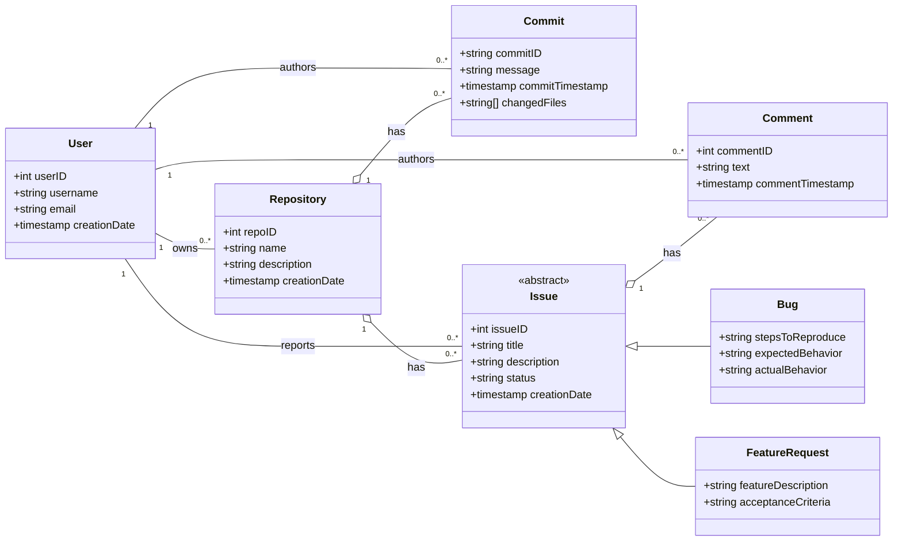

### **Rationale for Design Choices**

The UML class diagram above represents the entities for a source code repository management system. The design includes five main entities: `User`, `Repository`, `Commit`, `Issue` (as an abstract class), and `Comment`, with `Bug` and `FeatureRequest` as concrete implementations of `Issue`.

- **User**: Represents the developer who owns repositories, authors commits, and interacts with issues.
- **Repository**: Represents a project's code repository, which contains commits and issues.
- **Commit**: Represents a snapshot of changes to the code. It includes a list of changed files.
- **Issue**: An abstract class representing a generic issue. It has common attributes like `title`, `description`, and `status`.
- **Bug**: A concrete class that inherits from `Issue` and adds specific attributes for bug reports, such as `stepsToReproduce`.
- **FeatureRequest**: A concrete class that inherits from `Issue` and adds specific attributes for feature requests, such as `featureDescription`.
- **Comment**: Represents a comment on an issue.

**Relationships:**

- **User-Repository**: A `User` can own multiple `Repositories` (one-to-many).
- **User-Commit**: A `User` can author multiple `Commits` (one-to-many).
- **User-Issue**: A `User` can report multiple `Issues` (one-to-many).
- **User-Comment**: A `User` can author multiple `Comments` (one-to-many).
- **Repository-Commit**: A `Repository` has multiple `Commits` (composition).
- **Repository-Issue**: A `Repository` has multiple `Issues` (composition).
- **Issue-Comment**: An `Issue` has multiple `Comments` (composition).
- **Issue Inheritance**: `Bug` and `FeatureRequest` inherit from `Issue`, representing an "is-a" relationship.

**Complex Relationships:**

- **Inheritance Hierarchy**: The design now features a clear inheritance hierarchy with the abstract `Issue` class and its concrete subclasses, `Bug` and `FeatureRequest`. This approach allows for a more structured and extensible design, as new issue types can be added by creating new subclasses of `Issue`. This directly addresses the requirement for complex relationships in the assignment brief.
- **Composition**: The relationships between `Repository` and `Commit`, `Repository` and `Issue`, and `Issue` and `Comment` are modeled as composition. This accurately reflects that commits, issues, and comments are integral parts of their parent entities and cannot exist independently.
- **Arrays**: The `Commit` entity's `changedFiles` attribute is an array of strings, providing a flexible way to store a variable number of modified files for each commit without needing a separate `File` entity.

This refined design provides a robust and scalable model for a source code repository management system, adhering to the principles of object-oriented design and meeting the assignment's requirements for complex relationships.